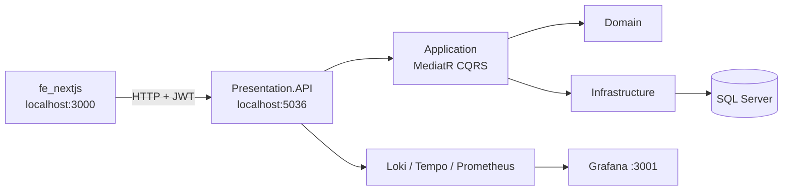

# ProjectCore — User & Role Management

Hệ thống quản lý người dùng, vai trò và quyền (RBAC) theo **Clean Architecture**: API ASP.NET Core + UI Next.js.

[](https://dotnet.microsoft.com/)
[](https://nextjs.org/)
[](https://www.microsoft.com/sql-server)
[](#)

**Repo GitHub:** [tungk36dl/dotNetCore_API](https://github.com/tungk36dl/dotNetCore_API)

---

## Mục lục

- [Tính năng](#tính-năng)
- [Công nghệ](#công-nghệ)
- [Kiến trúc](#kiến-trúc)
- [Cấu trúc repo](#cấu-trúc-repo)
- [Yêu cầu](#yêu-cầu)
- [Chạy nhanh bằng Docker](#chạy-nhanh-bằng-docker)
- [Chạy local (không Docker)](#chạy-local-không-docker)
- [Cấu hình môi trường](#cấu-hình-môi-trường)
- [API](#api)
- [Observability](#observability)
- [Tài liệu](#tài-liệu)
- [Quy ước đóng góp](#quy-ước-đóng-góp)

---

## Tính năng

- Đăng nhập JWT (access token + refresh token)
- CRUD user / role, gán role cho user
- Permission theo mã `MODULE.ACTION`, đồng bộ từ API (`POST /api/permissions/scan`)
- Seed tài khoản admin khi khởi động
- Phân trang, tìm kiếm user/role
- Swagger UI (Development)
- Logging (Serilog), metrics Prometheus, traces OpenTelemetry → Grafana stack

---

## Công nghệ

| Thành phần | Stack |
|------------|--------|
| Backend | ASP.NET Core 9, CQRS (MediatR), EF Core 9, SQL Server |
| Domain / Application / Infrastructure | .NET 8 |
| Auth | JWT Bearer (HS256), BCrypt |
| Frontend | Next.js 16 (App Router), React 19, TypeScript, Tailwind CSS 4, Zustand, Axios, Zod |
| Ops | Docker Compose, Loki, Tempo, Prometheus, Grafana |

---

## Kiến trúc

Quy tắc phụ thuộc: **Domain không phụ thuộc layer khác**. Presentation và Infrastructure phụ thuộc vào Application.

```text
Domain  ←  Application  ←  Infrastructure
                        ←  Presentation.API
```



Chi tiết convention: [PROJECT_RULES.md](./PROJECT_RULES.md).

---

## Cấu trúc repo

```text
.
├── ProjectCore/                 # Solution backend
│   ├── ProjectCore.Domain/
│   ├── ProjectCore.Application/
│   ├── ProjectCore.Infrastructure/
│   ├── ProjectCore.Presentation.API/
│   ├── docker-compose.yml
│   ├── Dockerfile
│   └── docs/api-spec.md
├── fe_nextjs/                   # Frontend Next.js
├── PROJECT_RULES.md             # Quy tắc BE + FE
└── README.md
```

---

## Yêu cầu

- [Git](https://git-scm.com/)
- [Docker Desktop](https://www.docker.com/products/docker-desktop/) **hoặc**
  - [.NET 9 SDK](https://dotnet.microsoft.com/download) + SQL Server
  - [Node.js 20+](https://nodejs.org/) (khuyến nghị LTS)

---

## Chạy nhanh bằng Docker

Khởi động API, SQL Server và stack quan sát từ thư mục `ProjectCore`:

```bash
git clone https://github.com/tungk36dl/dotNetCore_API.git
cd dotNetCore_API/ProjectCore
docker compose up --build
```

| Dịch vụ | URL |
|---------|-----|
| API | http://localhost:5036 |
| Swagger | http://localhost:5036/swagger |
| SQL Server | `localhost:1433` (sa / `YourStrong@Passw0rd`) |
| Grafana | http://localhost:3001 |
| Prometheus | http://localhost:9090 |

Tài khoản admin được seed (môi trường Docker Compose):

| Field | Giá trị |
|-------|---------|
| Username | `admin` |
| Password | `Admin@2026` |

Frontend chạy riêng (không nằm trong Compose):

```bash
cd fe_nextjs
cp .env.local.example .env.local
npm install
npm run dev
```

Mở http://localhost:3000 — `NEXT_PUBLIC_API_URL` phải trỏ tới `http://localhost:5036`.

---

## Chạy local (không Docker)

### 1. Database

Tạo database (ví dụ `office_games`) trên SQL Server. Cập nhật connection string trong `appsettings.Development.json` **hoặc** biến môi trường `ConnectionStrings__DefaultConnection`.

Lần đầu clone, tạo file cấu hình local từ template:

```bash
cd ProjectCore/ProjectCore.Presentation.API
cp appsettings.example.json appsettings.json
cp appsettings.Development.example.json appsettings.Development.json
# Production (Docker / deploy): cp appsettings.Production.example.json appsettings.Production.json
```

EF Core sẽ migrate / seed khi API khởi động (xem `Program.cs`).

### 2. Backend

```bash
cd ProjectCore
dotnet restore ProjectCore.sln
dotnet run --project ProjectCore.Presentation.API --launch-profile http
```

API: http://localhost:5036 — Swagger: http://localhost:5036/swagger

Profile `https` thêm https://localhost:7124.

### 3. Frontend

```bash
cd fe_nextjs
cp .env.local.example .env.local
npm install
npm run dev
```

CORS mặc định cho phép `http://localhost:3000` và `https://localhost:3000`.

---

## Cấu hình môi trường

**Không commit secret.** Các file sau **không** được đẩy lên Git (xem `.gitignore`):

| File | Môi trường | Nội dung |
|------|------------|----------|
| `appsettings.json` | Chung | Serilog, CORS, JWT issuer/audience (không secret) |
| `appsettings.Development.json` | Development | Connection string, JWT secret, admin seed |
| `appsettings.Production.json` | Production | DB Docker, Loki/Tempo, secret production |

Template an toàn (có trên repo): `appsettings.example.json`, `appsettings.Development.example.json`, `appsettings.Production.example.json`.

ASP.NET Core merge theo thứ tự: `appsettings.json` → `appsettings.{Environment}.json` → biến môi trường.

### Backend (appsettings / env)

| Key | Mô tả |
|-----|--------|
| `ConnectionStrings:DefaultConnection` | SQL Server |
| `JwtSettings:SecretKey` | Khóa HS256 (≥ 32 ký tự) |
| `JwtSettings:Issuer` / `Audience` | Issuer / audience JWT |
| `JwtSettings:AccessTokenExpirationMinutes` | TTL access token |
| `AdminSeed:*` | User admin seed |
| `AdminRole:*` | Role admin seed |
| `Cors:AllowedOrigins` | Origin frontend |
| `Loki:Uri` | Loki (để trống nếu không dùng) |
| `Otel:Endpoint` | OTLP gRPC Tempo (ví dụ `http://localhost:4317`) |

Biến môi trường kiểu Docker: `JwtSettings__SecretKey`, `ConnectionStrings__DefaultConnection`.

Có thể đặt file `.env` cạnh API (DotNetEnv): `ADMIN_USERNAME`, `ADMIN_EMAIL`, `ADMIN_PASSWORD`, …

### Frontend (`fe_nextjs/.env.local`)

```env
NEXT_PUBLIC_API_URL=http://localhost:5036
```

---

## API

Base path: `/api` — header: `Authorization: Bearer {accessToken}` — body: `application/json`.

Mọi response dùng envelope:

```json
{
  "success": true,
  "data": {},
  "message": "Success",
  "errors": []
}
```

| Nhóm | Method | Path |
|------|--------|------|
| Auth | POST | `/api/auth/login` |
| Auth | POST | `/api/auth/refresh` |
| Auth | GET | `/api/auth/me` |
| Auth | POST | `/api/auth/logout` |
| Users | GET/POST | `/api/users` |
| Users | GET/PUT/DELETE | `/api/users/{id}` |
| Users | GET | `/api/users/roles` |
| Roles | GET/POST | `/api/roles` |
| Roles | GET/PUT/DELETE | `/api/roles/{id}` |
| Permissions | POST | `/api/permissions/scan` |

Chi tiết request/response: [ProjectCore/docs/api-spec.md](./ProjectCore/docs/api-spec.md).

Metrics Prometheus (không cần JWT): `GET /metrics`.

---

## Observability

Khi chạy `docker compose` trong `ProjectCore`:

| Công cụ | Vai trò | Port host |
|---------|---------|-----------|
| Loki | Log | 3100 |
| Tempo | Trace (OTLP 4317/4318) | 3200 |
| Prometheus | Metrics | 9090 |
| Grafana | Dashboard | **3001** (tránh trùng Next.js :3000) |

Grafana Compose bật anonymous Admin để dev nhanh — **không dùng cấu hình này cho production**.

---

## Tài liệu

| File | Nội dung |
|------|----------|
| [PROJECT_RULES.md](./PROJECT_RULES.md) | Convention naming, folder, BE + FE |
| [ProjectCore/CLAUDE.md](./ProjectCore/CLAUDE.md) | Quy tắc solution backend |
| [ProjectCore/docs/api-spec.md](./ProjectCore/docs/api-spec.md) | Đặc tả API |
| [fe_nextjs/README.md](./fe_nextjs/README.md) | Ghi chú frontend |

---

## Quy ước đóng góp

1. Tuân thủ dependency rule Clean Architecture và CQRS (MediatR) — xem `PROJECT_RULES.md`.
2. Use case mới: `UseCases/{Domain}/{Commands|Queries}/{UseCaseName}/`.
3. Không đưa mật khẩu, connection string, JWT secret vào commit.
4. Frontend: service layer (`services/`) gọi API; không gọi Axios trực tiếp từ page nếu đã có pattern hiện tại.

Issue / Pull Request trên GitHub: [tungk36dl/dotNetCore_API](https://github.com/tungk36dl/dotNetCore_API).

---

## Lưu ý production

- Refresh token hiện lưu in-memory — mất khi restart, không scale ngang. Cần persist (DB/Redis) trước khi lên production.
- Ẩn Swagger UI ngoài Development (đã làm); đổi JWT secret và mật khẩu seed.
- Đồng bộ Target Framework giữa các project nếu triển khai thống nhất.

---

*Internship / internal learning project — Clean Architecture + Next.js.*
